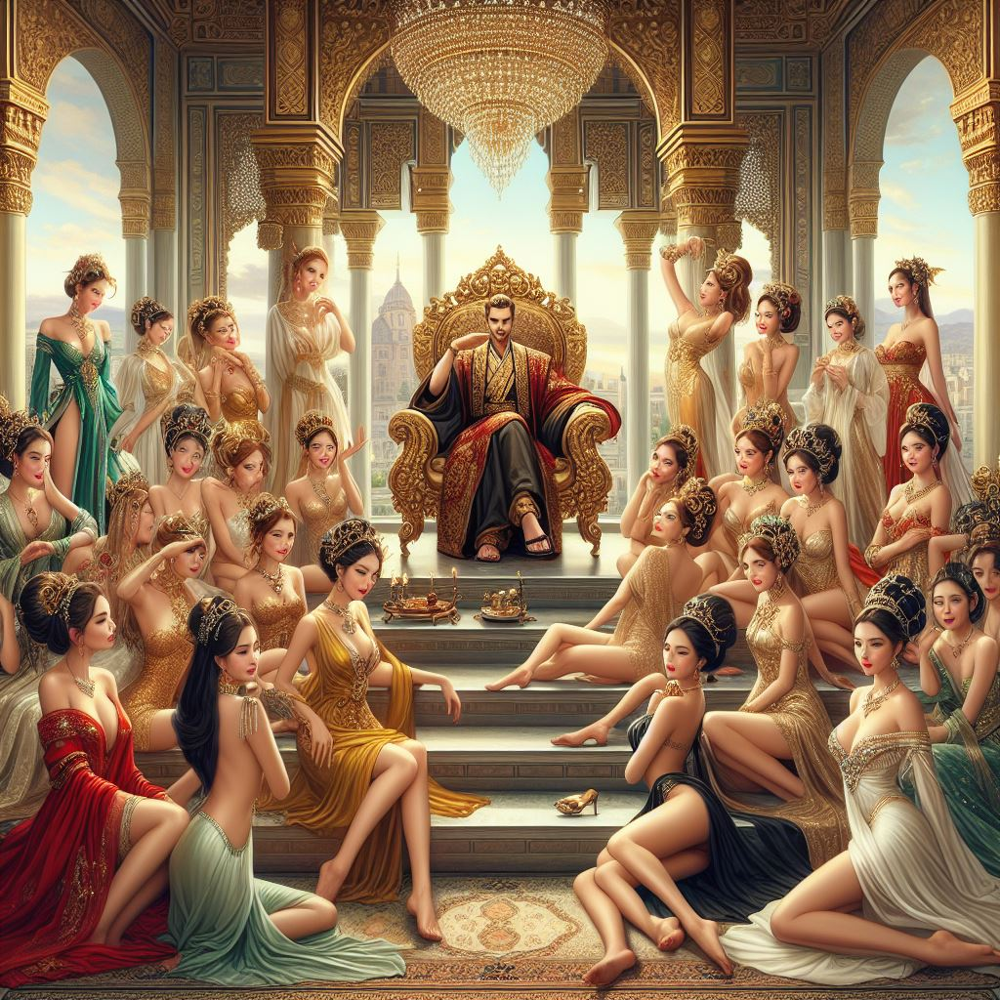

# 意淫
>**意淫**，是《红楼梦》原创的词汇，但后来演变成一个多义词，其词义、词性、用法均发生了很大的变化。
在《红楼梦》原著里面，意淫是小说的最高主题，是女儿尊贵论的实践理念，就是像贾宝玉那样对女儿美及天地间一切美好、清净、圣洁事物怀抱一颗普遍无私的爱戴、关怀、体贴、赞美、呵护、崇敬之心，以此节制肉体情欲，美化生活，美化心灵。

- [官方镜像](https://wangdoc.com/es6/)
- [JavaScript 教程](https://wangdoc.com/javascript)
- [TypeScript 教程](https://wangdoc.com/typescript)

警幻道：“尘世中多少富贵之家，那些绿窗风月，绣阁烟霞，皆被淫污纨绔与那些流荡女子悉皆玷辱。更可恨者，自古来多少轻薄浪子，皆以‘好色不淫’为饰，又以‘情而不淫’作案，此皆饰非掩丑之语也。好色即淫，知情更淫。是以巫山之会，云雨之欢，皆由既悦其色，复恋其情所致也。吾所爱汝者，乃天下古今第一淫人也。”宝玉听了，唬的忙答道：“仙姑差了。我因懒于读书，家父母尚每垂训饬，岂敢再冒‘淫’字。况且年纪尚小，不知‘淫’字为何物。”警幻道：“非也。淫虽一理，意则有别。如世之好淫者，不过悦容貌，喜歌舞，调笑无厌，云雨无时，恨不能尽天下之美女供我片时之趣兴，此皆皮肤淫滥之蠢物耳。如尔则天分中生成一段痴情，吾辈推之为‘意淫’。‘意淫’二字，惟心会而不可口传，可神通而不可语达。汝今独得此二字，在闺阁中，固可为良友；然于世道中未免迂阔怪诡，百口嘲谤，万目睚眦。” 
本书覆盖 ES6 与上一个版本 ES5 的所有不同之处，对涉及的语法知识给予详细介绍，并给出大量简洁易懂的示例代码。

本书为中级难度，适合已经掌握 ES5 的读者，用来了解这门语言的最新发展；也可当作参考手册，查寻新增的语法点。如果你是 JavaScript 语言的初学者，建议先学完[《JavaScript 语言教程》](https://wangdoc.com/javascript/)，再来看本书。

全书已由电子工业出版社出版，2017年9月推出了第三版，书名为《ES6 标准入门》。纸版内容截止到出版时，网站内容一直在修订。

- [淘宝](https://s.taobao.com/search?q=ES6%E6%A0%87%E5%87%86%E5%85%A5%E9%97%A8+%E7%AC%AC3%E7%89%88)
- [京东](https://search.jd.com/Search?keyword=ES6%E6%A0%87%E5%87%86%E5%85%A5%E9%97%A8%20%E7%AC%AC3%E7%89%88&enc=utf-8&wq=ES6%E6%A0%87%E5%87%86%E5%85%A5%E9%97%A8%20%E7%AC%AC3%E7%89%88)
- [当当](https://product.dangdang.com/25156888.html)
